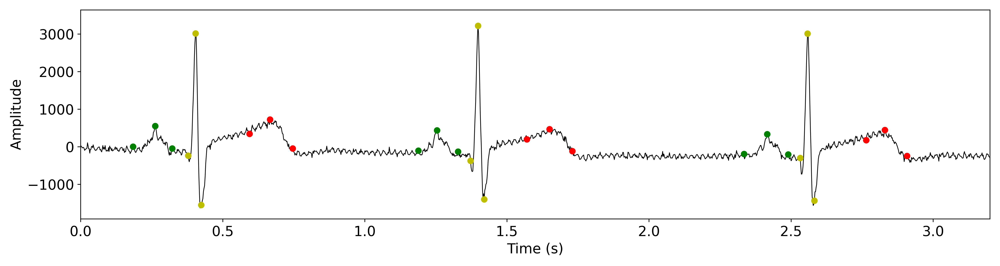

# Wavelet-Based ECG Delineator
This is a Python implementation of the wavelet-based delineator suggested by Martinez et al [1]. 

[1] Martinez, J. P., Almeida, R., Olmos, S., Rocha, A. P., & Laguna, P. (2004). A Wavelet-Based ECG Delineator Evaluation on Standard Databases. IEEE Transactions on Biomedical Engineering, 51, 570–581. 

### Repository description  
- The packages required can be found in `requirements.txt` (Python 3.8.5). 
- The source code can be found in [`wavedel/`](wavedel/).
- Run `python3 main.py` to delineate the 10s single-lead ECG recording in [`example/`](example/). Below is the resulting delineation (first seconds).

 

